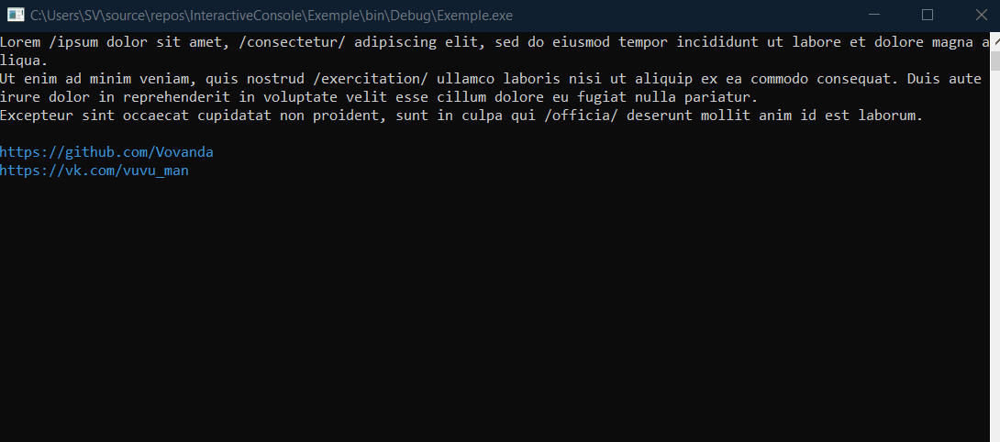

Interactive Console
=====
Interactive Console is a library that allows you to carry out interactive interaction: mouse clicks, hover, etc. both with the console and with ~~almost~~ any **Phrases** that are displayed in the terminal.

Any **phrase** must be specified using **regular expressions**.

> The only limitation at the moment is that the phrase template should not contain more spaces than the width of the console buffer, since the search area is limited to empty lines in the console.

However, for simple solutions, this library is pretty. Just see for yourself!

